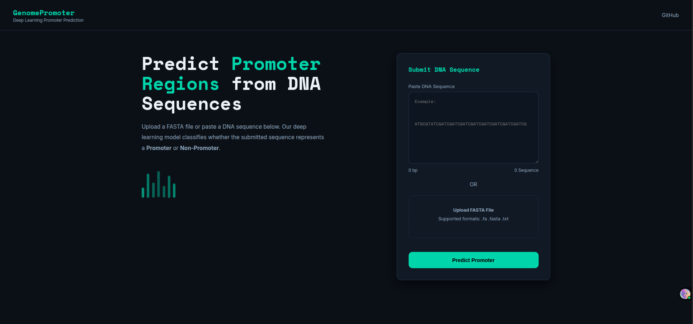
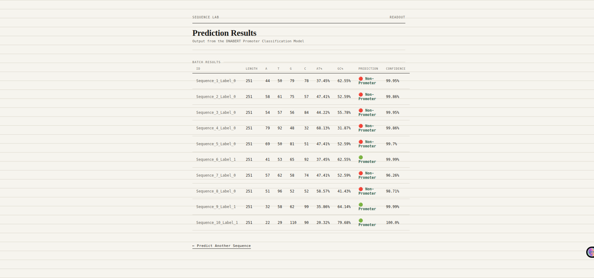
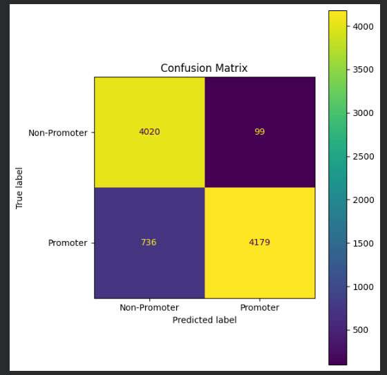
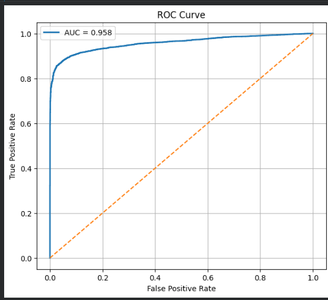
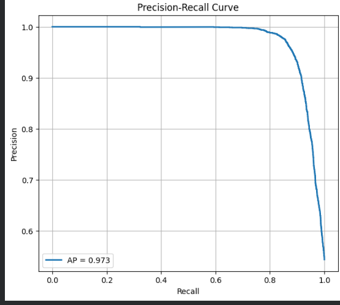

# 🧬 DNABERT Promoter Prediction Web Application

An end-to-end Bioinformatics web application for **promoter sequence prediction** using a fine-tuned **DNABERT Transformer** model.

The application enables researchers and students to predict whether DNA sequences are **Promoters** or **Non-Promoters** by either entering a single DNA sequence or uploading a FASTA file for batch prediction.

---

## 🚀 Features

- 🧬 Single DNA sequence prediction
- 📂 Batch prediction using FASTA files
- 🤖 Fine-tuned DNABERT Transformer model
- 🔬 Automatic 6-mer sequence generation
- 📊 Confidence score for each prediction
- 📏 Sequence length calculation
- 🧪 Nucleotide composition (A, T, G, C)
- 📈 AT% and GC% calculation
- ✅ DNA sequence validation
- 🎨 Modern responsive Flask web interface

---

# 🌐 Web Interface

## Home Page

The landing page allows users to either paste a DNA sequence or upload a FASTA file.

<p align="center">

</p>

---

## Prediction Results

For every prediction, the application displays:

- Prediction label
- Confidence score
- Sequence length
- A, T, G and C counts
- AT percentage
- GC percentage

<p align="center">

</p>

---

# 🧠 Deep Learning Model

The application uses a fine-tuned **DNABERT** model published on Hugging Face.

### 🤗 Hugging Face Model

https://huggingface.co/rahuls472/DNABERT-Promoter-Classifier

The model was trained for binary promoter classification using the Human Non-TATA Promoter benchmark dataset.

---

# 📊 Model Performance

| Metric | Score |
|---------|-------|
| Accuracy | **90.8%** |
| Weighted Precision | **92%** |
| Weighted Recall | **91%** |
| Weighted F1-score | **91%** |
| ROC-AUC | **0.958** |
| Average Precision | **0.973** |

---

## Confusion Matrix

<p align="center">

</p>

---

## ROC Curve

<p align="center">

</p>

---

## Precision-Recall Curve

<p align="center">

</p>

---

# 🧬 Why 6-mers?

DNABERT is pretrained using **overlapping 6-mer DNA tokens**, rather than raw nucleotide sequences.

For example,

```
ATCGTACG
```

is transformed into

```
ATCGTA
TCGTAC
CGTACG
```

Using the same preprocessing during inference as during training is essential for obtaining accurate predictions.

The application automatically performs 6-mer generation before sending sequences to the model.

---

# 📂 Project Structure

```
DNABERT-Promoter-Prediction-Web-Application
│
├── app.py
├── requirements.txt
├── README.md
│
├── Docs/
│   ├── landing_page.png
│   ├── Result_Page.png
│   ├── Confusion_Matrix.png
│   ├── ROC_Curve.png
│   └── Precision_Recall_Curve.png
│
├── modeling/
│   └── classifier_model.py
│
├── utils/
│   ├── fasta_parser.py
│   ├── sequence_stats.py
│   └── validator.py
│
├── templates/
│   ├── index.html
│   └── result.html
│
├── static/
│   └── style.css
│
├── testing_data/
│   └── test_seq.fasta
│
└── training_notebook/
    └── DNABERT_Promoter_Training.ipynb
```

---

# ⚙️ Installation

Clone the repository

```bash
git clone https://github.com/rahuls472/DNABERT-Promoter-Prediction-Web-Application.git
```

Move into the project directory

```bash
cd DNABERT-Promoter-Prediction-Web-Application
```

Install dependencies

```bash
pip install -r requirements.txt
```

Run the application

```bash
python app.py
```

Open your browser

```
http://127.0.0.1:5000
```

---

# 📂 Input Formats

### Single Sequence

```
ATGCGTAGCTAGCTAGCTAGCTAGCTAGCTA
```

---

### FASTA File

```
>Sequence_1
ATGCGTAGCTAGCTAGCTAGCTAGCTA

>Sequence_2
CGATCGATCGATCGATCGATCGATCGA
```

---

# 🛠 Technologies Used

- Python
- Flask
- PyTorch
- Hugging Face Transformers
- DNABERT
- HTML5
- CSS3

---

# 📚 Dataset

Human Non-TATA Promoter Dataset

Source:

https://huggingface.co/datasets/katarinagresova/Genomic_Benchmarks_human_nontata_promoters

---

# 👨‍💻 Author

**Rahul Kumar Singh**

M.Sc. Bioinformatics

Deen Dayal Upadhyaya Gorakhpur University

### GitHub

https://github.com/rahuls472

### Hugging Face

https://huggingface.co/rahuls472

### LinkedIn

https://www.linkedin.com/in/rahul-kumar-singh-1796b5332/

---

# 📜 License

This project is released under the MIT License.

---

# ⭐ If you found this project useful

Please consider giving the repository a ⭐ on GitHub.
